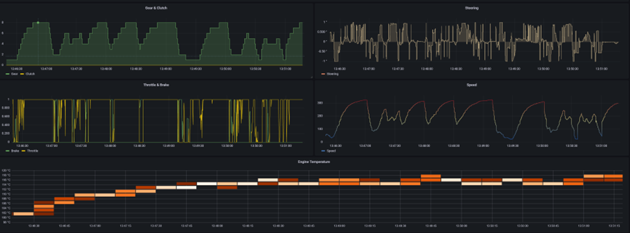

# Formula 1 - Telemetry Analytics with Azure Data Explorer

The project aims to use Azure Data Explorer(ADX) to analyze Formula 1 telemetry data from F1 202x game (by Codemasters) running on Microsoft Xbox, Sony Playstation.

ADX blog - https://techcommunity.microsoft.com/t5/azure-data-explorer-blog/f1-telemetry-analysis-with-azure-data-explorer-adx/ba-p/3283911

## Overview:


## :warning: Supported Format :warning: 

- The formula 1 telemetry library, used to decode the UDP packets, works with the F1 **2019 UDP format**. 
- It's possible to have the project working with F1 2020 & F1 2021 game.
- Selecting the **2019** UDP packet format in the **Telemetry Settings** on the game.


## Repo structure

/grafana - grafana dashboard to visualize the data.

/kusto - code to ingest data in ADX

/f1_telemetry  - server.py includes the code to listen to udp stream, f1_2019_struct.py - structure for F1 2019 format.

main.py - main module to start listening to udp stream, parse data & send it to ADX


## How to run F1 telemetry with the game

1. Install python dependencies 

```
pip install -r requirements.txt
```

2. Create ADX Cluster and a DB, run the scripts in /kusto/initialization/schema.kql to create necessary tables. Upload the data in /kusto/initialization/data to corresponding tables.

3. Create [Azure AD application registration](https://docs.microsoft.com/en-us/azure/data-explorer/provision-azure-ad-app) and configure following properties in `/kusto/ingest.js`
- Cluster Path
- Application (client) ID
- Secret Value
- Directory (tenant) ID
- DB Name 

4. Install the [ADX Data Explorer Data Source](https://grafana.com/grafana/plugins/grafana-azure-data-explorer-datasource/) in your Grafana instance. Upload the grafana dashboard to the instance, and provide necessary conenction properties from Step #3.

5. Start the F1 202x game, and turn on the UDP telemetry by providing UDP IP Address of your machine running python code. [Step by step instructions](https://www.simracingtelemetry.com/help/F12020/)
- By default, the code listens on port 20777 (default port for F1), and 0.0.0.0 IP. You can change the values in `server.py`

6. Start the python engine

```
python main.py
```

7. Set the grafana dashboard to 1s or 500ms to visualize the real-time charts. You will need to change the `min_refresh_interval` to 1s/500ms via the [config](https://grafana.com/docs/grafana/latest/administration/configuration/). 


## How to test F1 telemetry without running the game
If you want to test it without running the game, you can replay a previously
recorded session captured with wireshark or tcpdump and use send-pcap.py to send
the UDP packets. 

### Usage
Configure the following parameters inside send-pcap.py. Change the dst_ip to the local IP of your machine. 
```
  src_ip = ""
  dst_ip = ""
  infile = "f1pc.pcap"
```
After that run it with "python send-pcap.py" to replay udp stream.
To start listening to udp, and send data to Kusto - run "python main.py"

## Dashboard Visualizations





